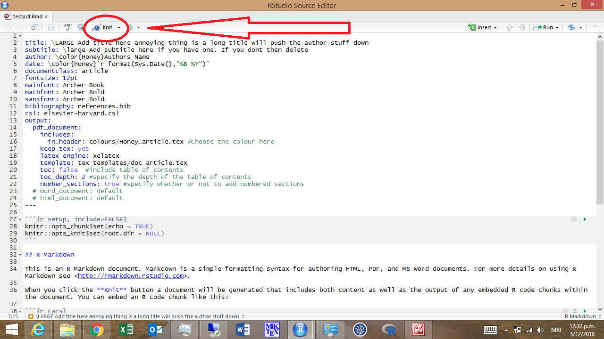

# DocRR

This repository contains a series of templates for creating HTML and PDF documents using the style themes employed by NZ Department of Conservation (DOC).

Install using ``devtools:install_github('ogansell/DocRR')``.

RStudio supports these templates natively. 

If using RStudio you can now load pre-made templates for outputting analysis and reporting in HTML or PDF format. To do this go to
File>New File and select 'RMarkdown'

From here you can now load any one of the templates by selecting 
RMarkdown>From Template and selecting any one of the templates under 'DocRR'.

Select the template you want to load, give it a name and save it. 

Important to note here is that when you save your file a folder structure for your file is automatically made. This is because the templates have some extra files they are dependant on in order to compile.

You've now got a template for producing a pdf report to begin working on.
Press the knit button to have a look at what it produces. 

If you're not using RSStudio it's still easy to use these templates.

To create a new document use ``rmarkdown::draft("docarticletest.Rmd", template = "doc_article", package = "DocRR")``.

``rmarkdown::draft("my_article.Rmd", template = "doc_article", package = "DocRR")``.

