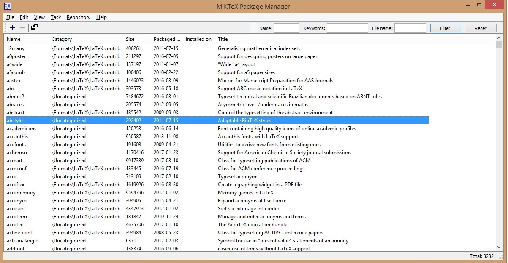
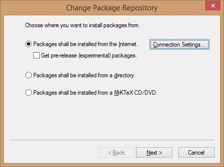
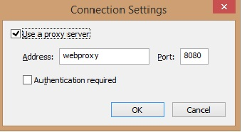
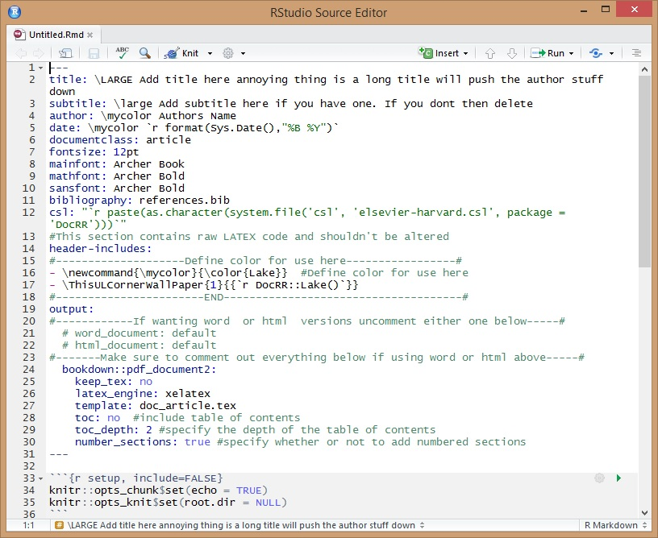
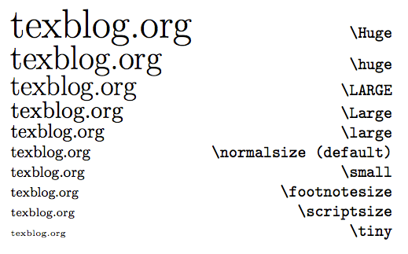
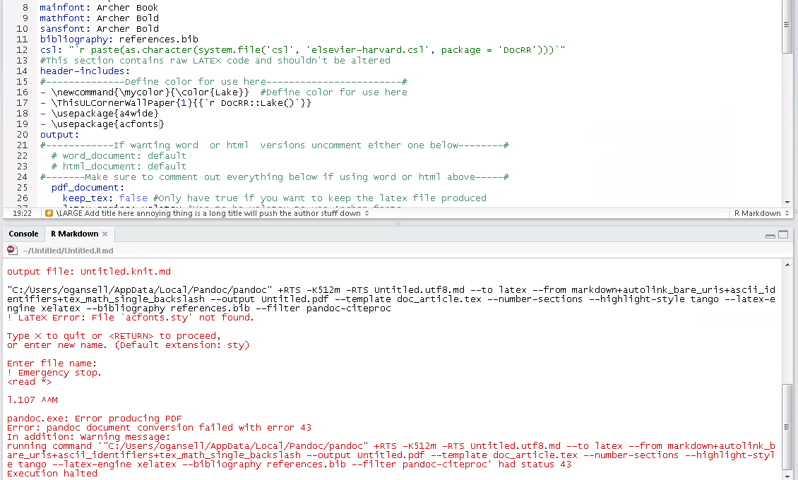

---
output:
  #bookdown::word_document2: #Use this if you need to output into word. The word document will contain webshots of any html/javascript content
  bookdown::html_document2:
    css: styles.css
    highlight: null
    keep_md: no
    self_contained: no #Controls whether document has dependencies or not. Has implications for file size and speed of loading
    number_sections: false #specify whether or not to add numbered sections
bibliography: references.bib
csl: http://www.doc.govt.nz/system/reporting/elsevier-harvard.csl 
---
<!--Customise header here-->
<header id="header">

<h1>DocRR</h1>
</header>
<h1 class="h1sub">Making reproducible reports in NZ Department of Conservation (DOC) approved styles</h1>

<!--Add some custom css to control font and table header colour or other style components where needed-->
<style> 
        h2 {color: `r DocRR::font_Lake()`}
        h3 {color: `r DocRR::font_Lake()`}
        h4 {font-size: 1.8em;color: `r DocRR::font_Lake()`}
        th {background-color : `r DocRR::font_Lake()`}
        body {max-width: 895px;}
        ul.nav.nav-tabs{width: 895px;}
</style>


##{.tabset .tabset-fade} 


This repository contains a series of templates for creating HTML and PDF documents in ``rmarkdown`` using the style themes employed by NZ Department of Conservation (DOC).


###Getting started

####Getting started


In order for PDF output to work you need to make sure you have a LaTeX distribution installed. [MiKTEX](https://miktex.org/) is the most common distribution to use.

####Installing the package


First off install the ``devtools`` package if you haven't already.

Paste the code into your ``R`` console and run it:

``install.packages("devtools")``

Now install the ``DocRR`` package using: 

``devtools::install_github('ogansell/DocRR')``.

####Creating a template in RStudio


RStudio supports these templates natively.You can download RStudio [here:](https://www.rstudio.com/products/rstudio/download/) 

If using RStudio you can now load pre-made templates for outputting analysis and reporting in HTML or PDF format. To do this go to
File>New File and select 'RMarkdown' (Figure \@ref(fig:rmarkdown1)).


```{r rmarkdown1, fig.cap = "Opening a new rmarkdown file within RStudio.",echo=FALSE}
knitr::include_graphics("rmarkdown1.bmp")
```


From here you can now load any one of the templates by selecting 
RMarkdown>From Template and selecting any one of the templates under ``DocRR``.

Select the template you want to load, give it a name and save it (Figure \@ref(fig:rmarkdown3)). 


```{r rmarkdown3, fig.cap = "The dialog box for saving a template.",echo=FALSE}
knitr::include_graphics("rmarkdown3.bmp")
```


Important to note here is that when you save your file a folder structure for your file is automatically made. This is because the templates have some extra files they are dependant on in order to compile (Figure \@ref(fig:rmarkdown4)).


```{r rmarkdown4, fig.cap = "The folder structure automatically created when a template is loaded.",echo=FALSE}
knitr::include_graphics("rmarkdown4.bmp")
```


You've now got a template for producing a pdf report to begin working on (Figure \@ref(fig:rmarkdown8)).
Press the knit button to have a look at what it produces. 

```{r rmarkdown8, fig.cap = "A loaded rmarkdown template",echo=FALSE}
knitr::include_graphics("rmarkdown8.bmp")
```


####After installation


When making HTML pages a common intermediate step is to ``knit`` your document to ``.docx`` format. This makes it easy to send to reviewers to get their input. The [webshot](https://cran.r-project.org/web/packages/webshot/vignettes/intro.html) package is useful in this instance as it includes a screenshot of any htmlwidgets used in the knitted ``.docx`` file. It requires installation of the PhantomJS software. This causes installation of the ``DocRR`` package to fail on older installations of ``R`` so it is recommended to install this manually after installing ``DocRR``. Do this by running the code:

``webshot::install_phantomjs()``.


####Creating a template outside of RStudio

If you're not using RStudio it's still easy to use these templates in base ``R``.

Wrapper functions have been made to make it easy to load a template.

There is one function for each template. The document names are examples only, you can name the ``".Rmd"`` file whatever you like.

Functions below:

``DocRR::article("myarticle.Rmd")``
``DocRR::article_book("myarticle.Rmd")``
``DocRR::report("myreport.Rmd")``
``DocRR::report_book("myreport.Rmd")``
``DocRR::plain_html("myplainwebpage.Rmd")``
``DocRR::tab_html("mytabbedwebpage.Rmd")``
``DocRR::indicator_html("myindicatorfactsheet.Rmd")``

To compile your document use: 

``rmarkdown::render("my_article/my_article.Rmd")``. 

Remember that you need to point it to the right directory, which means you need to include the folder which was automatically created to host your ``".Rmd"`` file.

####Extra information

You can now start making documents using these templates. It's important to remember that each template has been designed for a specific output (i.e. pdf articles or reports, plain webpages, web pages with tabbed layout or standardised pages for reporting on biodiversity indicators). Therefore the ``docarticle`` or ``docreport`` templates won't work for making webpages and web templates won't work for generating pdf's. Saying that, all of the templates will output to ``.docx`` (word format) provided some of the ``yaml`` metadata is altered (we'll cover this later). This is useful for giving reviewers who aren't familiar with ``R`` or ``rmarkdown`` a version of your document for editing and making comments. 

You'll see there are 2 versions of the article and report pdf templates (i.e. ``docarticle`` and ``docarticle_bookdown``). The ``bookdown`` package adds the extra utility of cross referencing tables and figures in text. This is especially handy for scientific/technical publications with lots of tables and graphs, but is also useful for images etc. Using the ``bookdown`` templates seems to cause some problems when knitting documents on some computers, so article and report templates have been included which do not use the ``bookdown`` package. Guidance on how to cross-reference using ``bookdown`` has been provided in each of the templates.To learn more about ``bookdown`` go to [https://bookdown.org/yihui/bookdown/](https://bookdown.org/yihui/bookdown/).


###Changing colours

####Changing colours


The templates in this package have all of the style elements needed to adjust the colour of banners or fonts according to the DOC style guidelines. There are 7 different colours to use for banners at the top of the first page and for text headings.  

Changing colours in PDF or web output normally requires some working knowledge of LaTeX, HTML and CSS code. To make life easier for users of this package functions have been defined in ``R`` to allow the user to easily choose whatever colour is required for banners and fonts in both web and pdf output. The colours for banners and fonts are shown in the table below. Beside each colour you can see the function for the banners for pdf articles and reports and for webpages. There is also a function for specifying the colour of headings for webpages. A different approach is used for colour of headings for PDF output.

<style type="text/css">
.tg  {border-collapse:collapse;border-spacing:0;}
.tg td{font-size:16px;padding:10px 5px;border-style:solid;border-width:1px;overflow:hidden;word-break:normal;}
.tg th{font-size:16px;font-weight:normal;padding:10px 5px;border-style:solid;border-width:1px;overflow:hidden;word-break:normal;}
.tg .tg-9hbo{font-weight:bold;vertical-align:top}
.tg .tg-amwm{font-weight:bold;text-align:center;vertical-align:top}
.tg .tg-yw4l{vertical-align:top}
</style>
<table class="tg">
<tr>
<th class="tg-9hbo">Colours</th>
<th class="tg-amwm" colspan="4">Functions</th>
</tr>
<tr>
<td class="tg-yw4l" rowspan="2"></td>
<td class="tg-amwm" colspan="3">Banners</td>
<td class="tg-amwm">Font</td>
<caption>(\#tab:colours) DOC colour palette and functions for using in ``rmarkdown``. </caption>
</tr>
<tr>
<td class="tg-amwm"></td>
<td class="tg-amwm">PDF Article</td>
<td class="tg-amwm">PDF Report</td>
<td class="tg-amwm">Web banner</td>
<td class="tg-amwm">Web font</td>
</tr>
<tr>
<td><span style="color:#59118E"><h5>Alpine</h5></span>

</td>
<td>``DocRR::Alpine``</td>
<td>``DocRR::Alpine_report``</td>
<td>``DocRR::Alpine_web``</td>
<td>``DocRR::font_Alpine``</td>
</tr>
<tr>
<td><span style="color:#008CB2"><h5>Lake</h5></span>

</td>
<td>``DocRR::Lake``</td>
<td>``DocRR::Lake_report``</td>
<td>``DocRR::Lake_web``</td>
<td>``DocRR::font_Lake``</td>
</tr>
<tr>
<td><span style="color:#E0219E"><h5>Sunset</h5></span>

</td>
<td>``DocRR::Sunset``</td>
<td>``DocRR::Sunset_report``</td>
<td>``DocRR::Sunset_web``</td>
<td>``DocRR::font_Sunset``</td>
</tr>
<tr>
<td><span style="color:#DD5900"><h5>Fauna</h5></span>

 </td>
<td>``DocRR::Fauna``</td>
<td>``DocRR::Fauna_report``</td>
<td>``DocRR::Fauna_web``</td>
<td>``DocRR::font_Fauna``</td>
</tr>
<tr>
<td><span style="color:#6D2C00"><h5>Kiwi</h5></span>

 </td>
<td>``DocRR::Kiwi``</td>
<td>``DocRR::Kiwi_report``</td>
<td>``DocRR::Kiwi_web``</td>
<td>``DocRR::font_Kiwi``</td>
</tr>
<tr>
<td><span style="color:#B5A80C"><h5>Honey</h5></span>

</td>
<td>``DocRR::Honey``</td>
<td>``DocRR::Honey_report``</td>
<td>``DocRR::Honey_web``</td>
<td>``DocRR::font_Honey``</td>
</tr>
<tr>
<td><span style="color:#808080"><h5>Greyscale</h5></span>

</td>
<td>``DocRR::Greyscale``</td>
<td>``DocRR::Greyscale_report``</td>
<td>``DocRR::Greyscale_web``</td>
<td>``DocRR::font_Greyscale``</td>
</tr>
</table>

###PDF output

####PDF output

Producing a PDF document from ``rmarkdown`` requires LaTeX be installed on your computer.As above, we recommend [MiKTEX](https://miktex.org/). Knitting to PDF can be a bit tricky at first. Behind the scenes a programme called ``pandoc`` is converting your ``rmarkdown`` document into a LaTeX document. LaTeX requires packages of it's own to do various tasks involved in producing the document. To get started you will need to ensure that MiKTEX can access it's package repository through the DOC proxy server.

If you've got MiKTEX installed search for and open the ``MiKTEX Package Manager`` in your program files (Figure \@ref(fig:miktex)).


```{r miktex, fig.cap= "The MiKTEX Package Manager dialog box.", echo=FALSE}

```

Click on ``Repository`` then ``Change Package Repository`` (Figure \@ref(fig:packagerepo)).

```{r packagerepo, fig.cap= "The MiKTEX Change Package Repository dialog box.", echo=FALSE}

```


Now click on ``Connection Settings`` (Figure \@ref(fig:connectionsettings)),

Add a tick to 'Use a proxy server' and add ``webproxy`` to the ``Address:`` box and ``8080`` to the ``Port:`` box. If you're working off the DOC system then you'll need to untick 'Use a proxy server` for everything to work.


```{r connectionsettings, fig.cap= "The MiKTEX Connection Settings dialog box.", echo=FALSE}

```

Now you're ready to start working on a document templates. Follow the instructions under the [Getting started](#getting-started) to open one of the pdf templates ``docarticle`` or ``docreport`` or one of the ``bookdown`` versions. 

Figure \@ref(fig:yaml) shows one of the templates to produce a pdf document. All of the text between the ``---`` lines is known as ``yaml``. This is essentially the document metadata and tells ``pandoc`` and therefore LaTeX everything it needs to know to produce the document. Don't worry too much about how it works.  

```{r yaml, fig.cap= "YAML heading in 'docarticle' pdf template", echo=FALSE}

```

In the ``yaml`` section you can see some notation such as ``\LARGE`` and ``\large`` . This is LaTeX code to specify the size of the title and subtitle. You can modify the titles and subtitles inserted there provided the ``\LARGE`` is at the front with a space between it and the actual title. Figure \@ref(fig:fontsize) shows the LaTeX commands for different font sizes. These can be used for changing font sizes for the title and subtitle in the ``yaml`` section.

```{r fontsize, fig.cap= "LaTeX commands for changing font size.", echo=FALSE}

```

Now we can specify the colour of the banner and font headers for the document. ``Lake`` has been set as the default colour. Where we see this in the ``yaml`` header:
````
#This section contains raw LATEX code and shouldn't be altered
header-includes:
#--------------------Define color for use here-----------------#
- \newcommand{\mycolor}{\color{Lake}}  #Define color for use here
- \ThisULCornerWallPaper{1}{{r DocRR::Lake()}}
#-----------------------END-------------------------------------#
````
We can see 2 LaTeX commands defined:
``\newcommand{\mycolor}{\color{Lake}}`` controls the colour for the font headings and ``\ThisULCornerWallPaper{1}{{r DocRR::Lake()}}`` controls the colour of the banner. To change your colours simply add a different colour at ``\newcommand{\mycolor}{\color{----}}`` and ``\ThisULCornerWallPaper{1}{{r DocRR::----()}}`` from one of the colour options in Table \@ref(tab:colours). Make sure not to change any of the other text otherwise the commands will not run successfully.


Now have a play with changing your colours and font size for titles and subtitles. If you have a really long title or subtitle it can push the  location of the author and date down the page. The best approach to this is to change the font size of your title and subtitle as needed to control how it influences the overall layout.

####Knitting to PDF

When you first knit to PDF ``pandoc`` converts the ``.Rmd`` document into a ``.tex`` LaTeX document which is then compiled to make a PDF article or report. As mentioned before, LaTeX uses packages to help carry out various tasks involved in compiling a document. When you first start making PDF documents MiKTEX will need to download and install the necessary packages. You'll need to approve each download or untick the box. 

__Insert photo of dialog box__

Sometimes documents fail to compile because MiKTEX can't download the necessary packages. When this happens you'll see an error message as in Figure \@ref(fig:packageerror). The best thing to do here is to try 'knitting' several times, as often the package will download after a few attempts. If this still doesn't work you may need to try a different package repository in MiKTEX or download the package manually.

```{r packageerror, echo=FALSE, fig.cap="Error message when packages fail to download." }



```


###HTML output

####HTML output

Generally making something for the web requires some knowloedge of HTML and CSS. HTML tells a webpage how it is structured and CSS tells a web page how each of the various elements defined in the HTML code are supposed to look. The ``DocRR`` package contains 3 HTML templates. All of them contain a little bit of HTML and CSS, however you don't need to know much about this in order to use these templates. Figure \@ref(fig:htmltemplate) shows one of the html templates from the ```DocRR`` package.  

```{r htmltemplate, echo=FALSE, fig.cap="Error message when packages fail to download." }

knitr::include_graphics("htmltemplate.png")

```

You can see that there is some text in between ``<`` and ``>`` symbols. This is HTML code and the ``< >`` symbols are known as tags. ``<->`` opens a tag and ``</>`` closes a tag. So where you see ``<h1>Title of page</h1>`` is where the title of the page should go because ``h1`` stands for the highest order in a series of headers. So if you want to change the title for this document simply put what ever text you want in between the ``<>`` tags ``<h1>A different title</h1>``. Provided the ``<h1>`` and ``</h1>`` are left unchanged everything should work fine. HTML code has been used in this instance as it works better with the design of the templates and the CSS developed to go along with it. 

CSS controls the style elements for the HTML document. If you knwo CSS you could change the look and feel of the font or table layouts for th document. However the ``DocRR`` templates have tried to minimise the amount of HTML or CSS the user needs to learn. In the section below the header you can see the code:

```
<!--Add some custom css to control font and table header colour or other style components where needed-->
<style> 
        h2 {color: `r DocRR::font_Lake()`}
        h3 {color: `r DocRR::font_Lake()`}
        h4 {color: `r DocRR::font_Lake()`}
        th {background-color : `r DocRR::font_Lake()`}
</style>

```
This sets the color for the font for each level of section header and background for any table headers. In HTML code this is shown by ``h2 h3 h4 th`` and translates to ``# ## ### ####`` in ``markdown`` text. The colour is set using CSS which is set in between the ``{}`` after each section header i.e. ``h2``. Normally you would need to know different __HEX__ codes for each colour which would look like this ``#FFFF00``. To make things easier wrapper functions have been defined to make it easy to choose different colours for the headings of HTML documents. So if you want to change your ``h2`` headers from <span style="color:`r DocRR::font_Lake()`">Lake</span> to <span style="color:`r DocRR::font_Alpine()`">Alpine</span>
simply refer to the functions from change Table\@ref(tab:colours) and change the name of the colour in the function ``DocRR::font_Lake()`` to ``DocRR::font_Alpine()``. To change the colour of the banner use the functions defined for changing the colour of web banners (Table\@ref(tab:colours)).  


###Word output

####Word output

There are no word templates established for this package, namely because working in Word does't lend itself to a reprodueable workflow. However Word (``.docx``) output is useful for sharing your work with others for the purposes of peer review and comment as many people are not familiar with working in ``rmarkdown``. 

Word versions of PDF or HTML templates can be easily produced using ``rmarkdown``. They do not have any style elements applied and should be used for getting feedback and review from others. Once you have all the feedback you need any changes should be incorporated back into your ``".Rmd"`` document. 

In order to produce ```.docx`` documents from any of the ``DocRR`` templates you need to remove some ``#`` from some of the ``yaml`` header and add ``#`` to other section of the ``yaml`` header. The ``#`` symbol tells ``R`` to ignore any content beginning in or following ``#``.

Look in the ``yaml`` header for the following:

````

#------------If wanting word  or html  versions uncomment either one below--------#
  # word_document: default 
  # html_document: default
#-------Make sure to comment out everything below if using word or html above-----#
  pdf_document:
    keep_tex: false #Only have true if you want to keep the latex file produced
    latex_engine: xelatex #Has to be xelatex to use Archer fonts
    template: doc_article.tex #Don't change this!!!
    toc: false  #include table of contents
    toc_depth: 1 #specify the depth of the table of contents
    number_sections: true #specify whether or not to add numbered sections
````
This tells ``pandoc`` that the ``.Rmd`` file is intended for producing a pdf document. If you want to produce a ``.docx`` document you need to remove the ``#`` symbol from ``word_document`` and add ``#`` symbols to everyline from ``pdf_document`` and down. So that section of the ``yaml`` would now look like this:
````
#------------If wanting word  or html  versions uncomment either one below--------#
  word_document: default 
  # html_document: default
#-------Make sure to comment out everything below if using word or html above-----#
  #pdf_document:
    #keep_tex: false #Only have true if you want to keep the latex file produced
    #latex_engine: xelatex #Has to be xelatex to use Archer fonts
    #template: doc_article.tex #Don't change this!!!
    #toc: false  #include table of contents
    #toc_depth: 1 #specify the depth of the table of contents
    #number_sections: true #specify whether or not to add numbered sections
````
This will now knit a ``.docx`` document. If you want to go back to pdf output you simply reverse the two steps just described.

###Markdown basics

####Markdown basics

####Writing text

An advantage of markdown is that it is a really simple typesetting language. The structure of it is really simple.

To make stuff **bold** use 2 '**' either side of your text

To make _italics_ use '_' either side of the text you want _italicized_

Most of the standard things involved in writing a report can be found [here](http://www.rstudio.com/wp-content/uploads/2016/03/rmarkdown-cheatsheet-2.0.pdf):

<iframe src="http://www.rstudio.com/wp-content/uploads/2016/03/rmarkdown-cheatsheet-2.0.pdf", width = 595px, height = 695px>allowfullscreen</iframe>

####Tables

Making and displaying tables in rmarkdown is really easy. If working with data and wanting to display a table we can use the ``kable`` function in ``R`` like this:

```{r kable table, warning=FALSE, message=FALSE}
require(knitr)#Need to load the knitr library

kable(head(iris,10)) #Display the first 10 rows of the dataset

```

``kable`` works really well with HTML or PDF output and for simple tables. It also works really well in this type of workflow where you have your analysis in the same workflow and you need to output a summary table.

If displaying solely in HTML the ``DT`` library has some good options for displaying more complex data.

```{r DT table}
require(DT)
datatable(iris)

```

You'll see that ``DT`` tables have more options for filtering and searching data. This can be helpful if you have a more complicated table you want to show. ``DT`` tables don't work if you want a PDF report.

You can also generate a table in straight markdown.

This looks like this:

```{}
| Sepal.Length | Sepal.Width | Petal.Length | Petal.Width | Species |
|--------------|-------------|--------------|-------------|---------|
| 5.1          | 3.5         | 1.4          | 0.2         | setosa  |
| 4.9          | 3.0         | 1.4          | 0.2         | setosa  |
| 4.7          | 3.2         | 1.3          | 0.2         | setosa  |
| 4.6          | 3.1         | 1.5          | 0.2         | setosa  |
| 5.0          | 3.6         | 1.4          | 0.2         | setosa  |
| 5.4          | 3.9         | 1.7          | 0.4         | setosa  |
| 4.6          | 3.4         | 1.4          | 0.3         | setosa  |
| 5.0          | 3.4         | 1.5          | 0.2         | setosa  |
| 4.4          | 2.9         | 1.4          | 0.2         | setosa  |
| 4.9          | 3.1         | 1.5          | 0.1         | setosa  |
```

But renders in HTML like this:

| Sepal.Length | Sepal.Width | Petal.Length | Petal.Width | Species |
|--------------|-------------|--------------|-------------|---------|
| 5.1          | 3.5         | 1.4          | 0.2         | setosa  |
| 4.9          | 3.0         | 1.4          | 0.2         | setosa  |
| 4.7          | 3.2         | 1.3          | 0.2         | setosa  |
| 4.6          | 3.1         | 1.5          | 0.2         | setosa  |
| 5.0          | 3.6         | 1.4          | 0.2         | setosa  |
| 5.4          | 3.9         | 1.7          | 0.4         | setosa  |
| 4.6          | 3.4         | 1.4          | 0.3         | setosa  |
| 5.0          | 3.4         | 1.5          | 0.2         | setosa  |
| 4.4          | 2.9         | 1.4          | 0.2         | setosa  |
| 4.9          | 3.1         | 1.5          | 0.1         | setosa  |

The website [http://www.tablesgenerator.com/](http://www.tablesgenerator.com/) is really useful for converting tables between different formats. The advantage of using markdown format is that it gives more flexibility for situations where you may need to to more editing inside a table, such as adding footnotes which you would do like this:

```{}
| Sepal.Length [^1] | Sepal.Width | Petal.Length | Petal.Width | Species |
|--------------|-------------|--------------|-------------|---------|
| 5.1          | 3.5         | 1.4          | 0.2         | setosa  |
| 4.9          | 3.0         | 1.4          | 0.2         | setosa  |
| 4.7          | 3.2         | 1.3          | 0.2         | setosa  |
| 4.6          | 3.1         | 1.5          | 0.2         | setosa  |
| 5.0          | 3.6         | 1.4          | 0.2         | setosa  |
| 5.4          | 3.9         | 1.7          | 0.4         | setosa  |
| 4.6          | 3.4         | 1.4          | 0.3         | setosa  |
| 5.0          | 3.4         | 1.5          | 0.2         | setosa  |
| 4.4          | 2.9         | 1.4          | 0.2         | setosa  |
| 4.9          | 3.1         | 1.5          | 0.1         | setosa  |
Table: A table about some sort of flower

[^1]: A footnote about Sepal length
```

Which looks like this:


| Sepal.Length [^1] | Sepal.Width | Petal.Length | Petal.Width | Species |
|--------------|-------------|--------------|-------------|---------|
| 5.1          | 3.5         | 1.4          | 0.2         | setosa  |
| 4.9          | 3.0         | 1.4          | 0.2         | setosa  |
| 4.7          | 3.2         | 1.3          | 0.2         | setosa  |
| 4.6          | 3.1         | 1.5          | 0.2         | setosa  |
| 5.0          | 3.6         | 1.4          | 0.2         | setosa  |
| 5.4          | 3.9         | 1.7          | 0.4         | setosa  |
| 4.6          | 3.4         | 1.4          | 0.3         | setosa  |
| 5.0          | 3.4         | 1.5          | 0.2         | setosa  |
| 4.4          | 2.9         | 1.4          | 0.2         | setosa  |
| 4.9          | 3.1         | 1.5          | 0.1         | setosa  |
Table: A table about some sort of flower


[^1]: A footnote about Sepal length


####Figures

When writing a report in Microsoft Word or similar and you want to display graphs and figures you have to generally copy and paste plots manually into your document. This lends itself to making mistakes and becomes tedious when your data/presentation changes. 

Using ``rmarkdown``, ``R`` (or other language) and ``knitr`` it is really easy to place your figure in your work exactly where you want it to go. If your data changes then it is as simple as ensuring your new data is called to update your figure.Figure \@ref(fig:flowers) tells us simple things about the ``iris`` dataset.

```{r flowers, warning=FALSE, message=FALSE, fig.cap= 'Something to do with flowers', fig.height=3,fig.width=5}

plot(iris)

```


